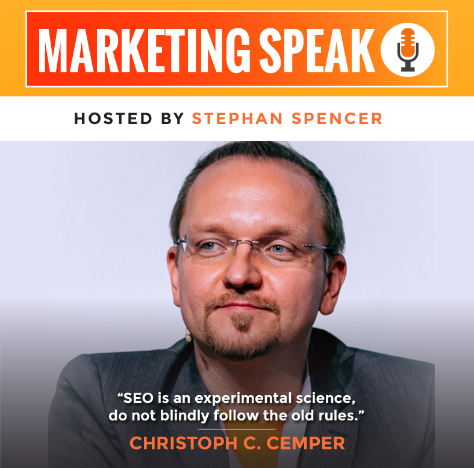
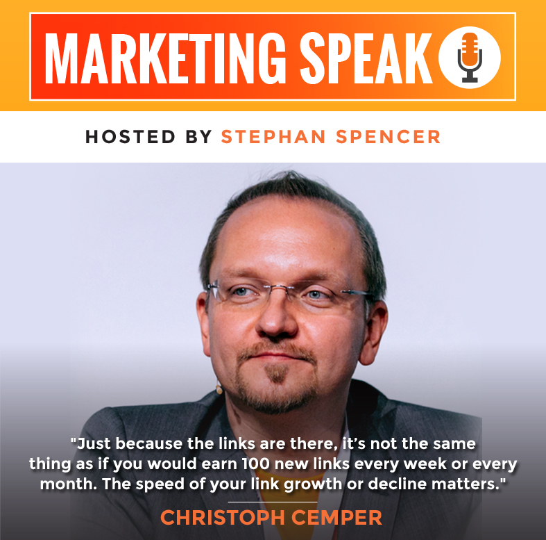

{}

## Christoph C. Cemper interviewed by Effektiv at SMX 2018 about Link Building (German)



## Christoph C. Cemper in SEODRIVEN (German)



Wir sprechen darüber, warum der Pinguin Schock auch 2018 viele Unternehmen immer noch vom Linkbuilding abhält, warum Suchmaschinenoptimierung nicht nur aus Hygiene-Maßnahmen besteht und worum sich selbst Inhouse SEOs großer Brands in Bezug auf Backlinks unbedingt kümmern sollten.

## Christoph C. Cemper in a two part series of the Marketing Speak Podcast

### Christoph Cemper: Link Building Secrets of the Masters, Part 1 of 2

One of the tricky (and frustrating) things about SEO is that once you’re penalized by Google, it can be hard to recover. This is particularly true for manual penalties, as opposed to algorithmic penalties. And, as if that in itself weren’t stressful enough, there’s an added stressor in the fact that Google has a history of penalizing retroactively.

Here to guide you through this potential minefield is Christoph Cemper, a guru at link analysis who has been a noteworthy figure in the online marketing space since the early 2000s. He created the remarkable LinkResearchTools, an amazing toolset that can help you triage your bad links. Today, we’ll chat about analyzing your link profile, the important differences between 302 and 301 redirects, and much more. And get this: there was so much good stuff to cover, that this interview is part 1 of 2!

[Link to Part 1](https://www.marketingspeak.com/link-building-secrets-of-the-masters-part-1-of-2-christoph-cemper/)

[Link to the full transcript of Part 1](https://www.marketingspeak.com/transcripts/christoph-c-cemper/)

### Christoph Cemper: Link Building Secrets of the Masters, Part 2 of 2

If you’re a faithful listener of the show, you probably remember the remarkable episode from a few weeks ago with Christoph Cemper. In that episode, we discussed analyzing your link profile, different types of redirects, and much more. Christoph had so much wisdom to share that we decided to do a part 2 so he can bring you more of his incredibly useful knowledge!

Christoph created the remarkable LinkResearchTools, an amazing toolset with lots of incredibly useful features that I use frequently. In this second half of the conversation, we spend more time digging into 302 versus 301 redirects. We then go into depth about what to do if you’ve received penalties (whether algorithmic or manual) and how to perform an effective cleanup process. In the lightning round at the end, Christoph offers even more amazing value, including a chance to win a free spot at his upcoming training event.

[Link to Part 2](https://www.marketingspeak.com/link-building-secrets-masters-christoph-cemper-part-2/)

[Link to the full transcript of Part 2](https://www.marketingspeak.com/transcripts/christoph-cemper-part-2/)

------

## The Secret Art of Internet Traffic with Grant Cardone at Ask The Pro



## Christoph C. Cemper, CEO of LinkResearchTools – Winning Link Research Strategy – BrightonSEO 2016



------

## Christoph C. Cemper about the Primary Mistakes SEO make at the Super Affiliate Show July 2017

[Full source link.](https://calvinayre.com/2017/10/18/business/christoph-cemper-primary-seo-mistake-affiliates-make-video/)

------

## Plausch in der SEO Küche mit Christoph C. Cemper (German)

[Full source link](https://www.seo-kueche.de/blog/plausch-in-der-kueche-mit-christoph-c-cemper/)

------

## Christoph in Gambling Affiliate Voice

[Full source interview](https://gamblingaffiliatevoice.com/news/exclusive-interview-with-christoph-c-cemper/)
