# LRT Challenge for the last ticket to the SEOktoberfest

The SEO event that [helped shape lives and careers](/blog/bring-your-business-life-to-a-new-level-at-this-sold-out-event).

## LinkResearchTools helped collect ≈ $300.000 in charity.

LinkResearchTools was the main sponsor of the charity BBQ day  SEOktoberfest charity BBQ

From 2012 to 2017 LinkResearchTools helped collect ca. $300.000 in charity money.

We also gave many SEO professionals the chance to take part in the most exclusive SEO event ever.

Every year, the tickets for SEOktoberfest sold out within minutes, despite the substantial price tag of 5.000 Euros. However, nobody could buy the last ticket.

As a main sponsor, from 2012 and 2017, LinkResearchTools bought the privilege to the last ticket for SEOktoberfest.

Thousands of SEOs from all around the world joined the challenges for winning the last ticket to SEOktoberfest.

The name of the challenge changed over the years from

- SEO Scavenger Hunt
to
- LRT Challenge

but it always involved very challenging tasks, be it writing highly sophisticated case-studies in a race for the most links and social shares over many months, or taking part in a real-time SEO scavenger hunt.

### Silvia Martin

 [GLOBETROTTER2DISCOVER](http://www.globetrotter2discover.com/)

Winner of the LinkResearchTools Challenge for SEOktoberfest X.

### Christiaan Bollen

[Boljoro](https://www.boljoro.com/)

Winner of the LinkResearchTools Challenge for SEOktoberfest IX.

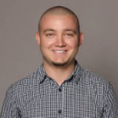

### Wojtek Mazur

[Elephate](https://web.archive.org/web/20160916004714/http://www.elephate.co/)

Winner of the LinkResearchTools Challenge for SEOktoberfest VIII.

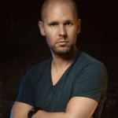

### Bartosz Goralewicz

[Elephate](https://web.archive.org/web/20160916004714/http://www.elephate.co/)

Winner of the LinkResearchTools Challenge for SEOktoberfest VII.

### Sebastian Weber

[Idealo](https://www.idealo.de/)

Winner of the LinkResearchTools Challenge for SEOktoberfest VI.

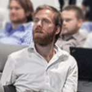

### Stefan Juhl

[Boligbesked.dk ApS](https://www.boligbesked.dk/)

Winner of the LinkResearchTools Challenge for SEOktoberfest V.

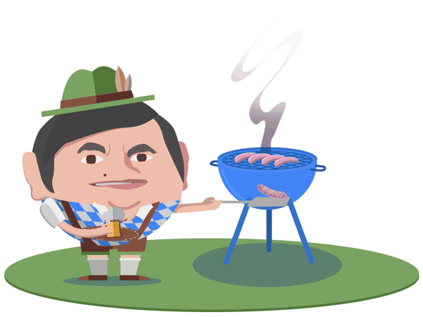

## SEOktoberfest changed many lives for the better

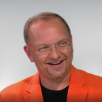

> *This event has shaped my life, my friends, my career, my business over the years.*
>
> *My company LinkResearchTools sponsored the Charity BBQ for years and helped collect ~USD 300.000 with this alone thanks to the great initiative by [Marcus Tandler](https://www.facebook.com/tandler?fref=mentions) and his team.*
>
> Christoph C. Cemper | [LinkResearchTools](https://www.linkresearchtools.com/)

> *Winning the 2015 Seoktoberfest challenge is one of my greatest achievements. I take much pride in it because winning a ticket wasn’t a matter of luck – it was a matter of hard work and effort. I put my heart and soul into the challenge, and I am happy it turned out to be such a rewarding experience!*
>
> *Getting the first prize opened up new doors for me – I got invited for one of the most amazing SEO conferences ever. First and foremost, though, I became a part of the recognized experts’ community and made friends with many people who have always been authorities for me.*
>
> Wojtek Mazur | [Elephate](https://web.archive.org/web/20160916004714/http://www.elephate.co/)

> *Becoming part of the SEOktoberfest group of people with their incredible wealth of knowledge and attending what is definitely the top SEO event is simply priceless! So I’m obviously really happy that I won the SEO Scavenger Hunt and got to take part in all this.*
>
> Stefan Juhl | [Boligbesked.dk Aps](https://www.boligbesked.dk/)

> *I was fortunate enough to win the LinkResearchTools scavenger hunt in 2013, and I can say with confidence: it changed my life!* *Not only meeting the brightest minds in SEO, but actually getting to know them, see what works and what doesn’t and a sense of community that is still there until this day.*
>
> *It also put me in a position to land my dream job — I met the VP of SEO of TripAdvisor, moved from Germany to the US and am loving every minute of it!*
>
> Sebastian Weber | [Idealo](https://www.idealo.de/)

## The winners got to spend a week these fine SEO experts from all over the world.

### Alex Schultz

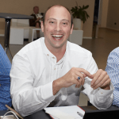

---

### Joost de Valk

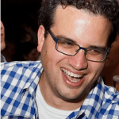

---

### William Sears

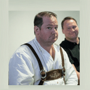

---

### Robert Hansen

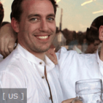

---

### Joe Sinkwitz

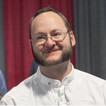

---

### Michelle Robbins

---

### Marty Weintraub

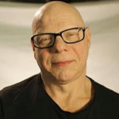

---

### Duane Forrester

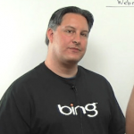

---

### Bob Rains

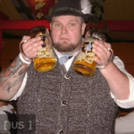

---
### Lisa Myers

---
### Dave Naylor

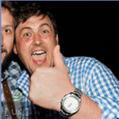

---
### Dan Petrovic

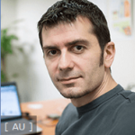

---
### Marcus Tandler

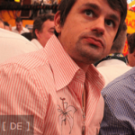

---
### Dennis Goedegebuure

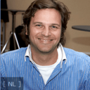

---
### Kristopher B. Jones

---
### Curt Harlinghausen

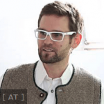

---
### Cindy Krum

---
### Aleyda Solis

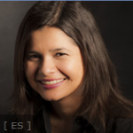

---
### Brent Csutoras

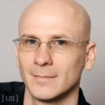

---
### Fili Wiese

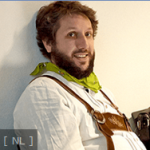

---
### Marcus Tober

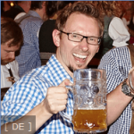

---
### Avi Wilensky

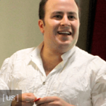

---
### Michael King

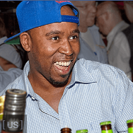

---
### Tom Anthony

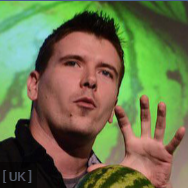

---
### Derek Devlin

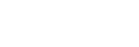

---
### Jono Alderson

---
### Frank Watson

---
### Bastian Grimm

---
### Kaspar Szymanski

---
### Carolyn Shelby

---
### Sri Sharma

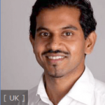

---
### Grigory Bakunov

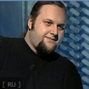

---
### Barbara Boser

---
### Greg Boser

---
### Tim Mayer

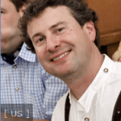

