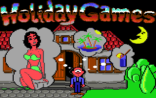

This was the last game released commercially by JEZ + YON

Programmed By: Chris Cemper

Graphics By: Gerald Vogl & Friedrich Flekna (Da Kibara)

Sound By: Stefan Woltran, Stax & Lorus, Published 1993 on Golden Disk Magazine via CP Verlag

   

## Games Reviews 

[*** Stadium64 @ Emuunlim ***](http://web.archive.org/web/20121017123936/http://s64.emuunlim.com/gameinfos/holidaygames/holidaygames.htm)
[C64GG](http://web.archive.org/web/20121017123936/http://www.c64gg.com/H9.html)
[LEMON64](http://web.archive.org/web/20121017123936/http://www.lemon64.com/?mainurl=http%3A//www.lemon64.com/games/details.php%3FID%3D1212)
Download at [Nostalgia.pl](http://web.archive.org/web/20121017123936/http://www.nostalgia.pl/download/commodore64/games/h/holiday_games.zip)
[Amiga Island](http://web.archive.org/web/20121017123936/http://www.server2-amiga-island.de/html/c64_h2.html)

## Music

playing one of 8 great ingame tunes by Wuiti, Stax and Lorus... make sure you download the SID-tunes [here](http://web.archive.org/web/20121017123936/http://c64.cemper.com/MyGames/MyGames/holiday games/Holiday_Games.sid) and listen to all of them in Sidplay/w.