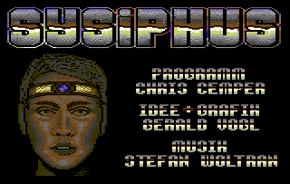

# Games by Chris Cemper - work in progress

These games were developed when I was age 14-17. After that I had to stop due to school. Shortly later that year my partner Yon took his life, which ended our entrepreneurial success story in the C64 games business. **RIP YON.**

*see me coding on a demo, hours after midnight on a Commodore SX-64 with a terribly small screen.*

## This page was taken over from c64.cemper.com where it was last edited in 2004 

Some broken links still need to be corrected with the help of web.archive.org or other source.

I remember how this was the first HTML Table I created in my life :smile:

| Game name        | What it is | Where I sold it to | Screenshot | More |
| --------------------------------------------- | ------------------------------------------------------------ | ------------------------------------------------------------ | ------------------------------------------------------------ | ------------------------------------------------------------ |
| Duotris                                       | first game released commercially by Jez and Yon. We sent out several copies, all byte-coded (with a special byte in the gamecode that idemtified the recipient in a hidden way...). The byte-code was needed pretty soon when a lamer of AMOK gave a copy of the game to Genesis Project, german cracking-group which boasted by cracking an unprotected game... Well after that we had mere troubles to find someone paying for it, but well.. we did. | Published: Game On Magazine via CP Verlag (1989)             |  | more [here...](http://web.archive.org/web/20160406100959/http://c64.cemper.com/MyGames/duotris.html) |
| Sysiphus                                      | A great sokoban-like game - **although a lot of C64-pages title this game "Sysiphus in Aegypten", it is not! **the name of this game simply SYSIPHUS | Published: GAME ON Magazine 11/91 B via CP Verlag (1991)     |  | more [here...](http://web.archive.org/web/20160406100959/http://c64.cemper.com/MyGames/sysiphus.html) |
| Sysiphus II - Sysiphus in Ägypten             | the real Sysiphus 2 - great role-playing gameHow do you like the huge title-page? glamour and celebrity on the good old 64 !!Say "J" to load the "demo" (that is this title).*** **beware: do not load the game with fastloader, use F2 in the CCS64.** | Published: GAME ON Magazine 01/92 B via CP Verlag (1992)     |  | more [here...](http://web.archive.org/web/20160406100959/http://c64.cemper.com/MyGames/sysiphus2.html) |
| Rock, Paper and Shear = Schere, Stein, Papier | nice matchin-game, god knows who translated the game to english? we NOT | Published: GAME ON Magazine via CP Verlag                    |  | more [here...](http://web.archive.org/web/20160406100959/http://c64.cemper.com/MyGames/scheresteinpapier.html) |
| Holiday Games                                 | last game released commercially by JEZ + YON creating this multi-discipline game took us a mere 6-8 weeks in the summer holidays. it was tough work with endless work hours but not so well paid for the effort... at least for those times.. | Programmed By: Chris Cemper, Graphics By: Gerald Vogl & Friedrich Flekna, Sound By: Stefan Woltran, Stax & Lorus, Published 1993 on Golden Disk Magazine via CP Verlag |  | more [here...](http://web.archive.org/web/20160406100959/http://c64.cemper.com/MyGames/holidaygames.html) |
| MineFields                                    | a nice little inbetween game (meaning the coding aswell as for real playing). I was already active on the PC and found Bill Gate$ "Minesweeper" to cool so I ported it to 64-release! | Published: GAME ON Magazine via CP Verlag (04/1992)          |  | more [here...](http://web.archive.org/web/20160406100959/http://c64.cemper.com/MyGames/minefields.html) |
| Ice Blaster                                   | Although I finished coding to 99%, I never released this game to public. | Copyright Dome Development 1994??? Who the hell is this? I was not active in 1994 on the c64, therefore I guess they just **stole** it from me? I guess it was again some AMOK-Lamer or G*P boy, giving this to some US-lamers for "cracking" and "fixing"... haha this should never have reached the public... only one person had a copy of it... well... so we know again who was lame... |  | more [here...](http://web.archive.org/web/20160406100959/http://c64.cemper.com/MyGames/iceblaster.html) |
| Notemaker                                     | Overlay your text with colorrasters. little tool sold to Magic Disk |                                                              | Download at [Nostalgia.pl](http://web.archive.org/web/20160406100959/http://www.nostalgia.pl/download/commodore64/c64_utilities/noters/Note-Maker_v1_1[Magnetix].zip) | check out [at LEMON64](http://web.archive.org/web/20160406100959/http://www.lemon64.com/?mainurl=http%3A//www.lemon64.com/apps/list.php) |
| Jezdoc Writer                                 | Overlay your text with colorrasters. little tool sold to Magic Disk |                                                              | Download at [Nostalgia.pl](http://web.archive.org/web/20160406100959/http://www.nostalgia.pl/download/commodore64/c64_utilities/noters/Jezdoc-Writer[Acrise].zip) | check out                                                    |

<h3 class="RIP">Dedicated to Gerald Vogl (YON of Magnetix) who was a great creative partner and friend for many years! </h3>

